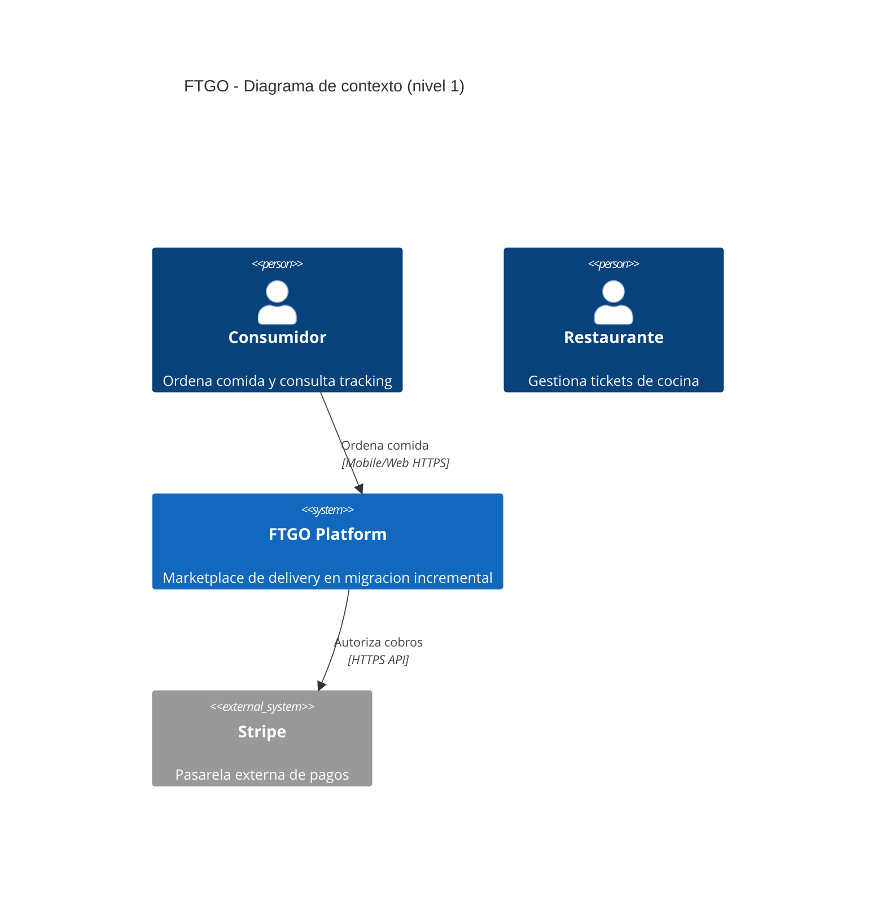
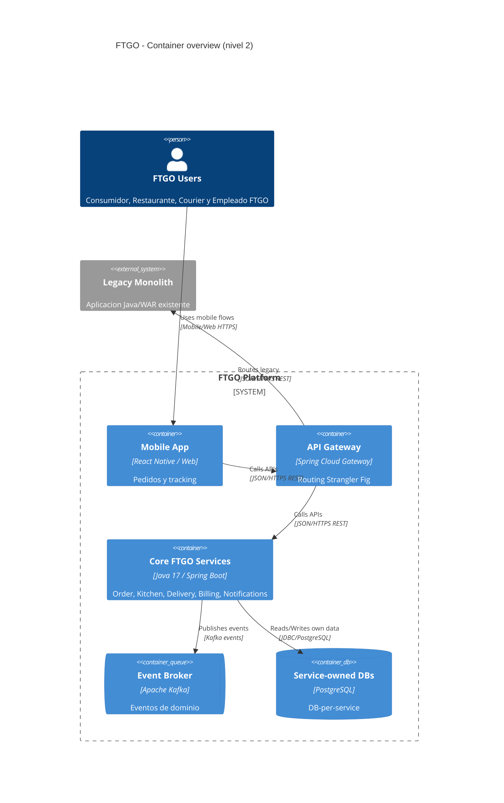

# Prompt mejorado - Diagramas C4 Mermaid de FTGO

## Metadatos

| Campo | Valor |
|---|---|
| ID | PR-C4-FTGO-001-MEJORADO |
| Artefacto destino | `docs/diagrams/c4_context.mmd`, `docs/diagrams/c4_container.mmd`, `docs/diagrams/c4_container_order_checkout.mmd`, `docs/diagrams/c4_container_kitchen_ticket.mmd`, `docs/diagrams/c4_container_delivery_flow.mmd`, `docs/diagrams/c4_container_event_flow.mmd`, `docs/diagrams/c4_container_data_ownership.mmd` |
| Version | v0.2 |
| Base | Prompt semilla B.4 - Diagramas C4 nivel 1 y 2 de FTGO |

## Role

Eres un arquitecto de software senior especializado en C4 Model, Mermaid C4 y
migraciones incrementales desde monolito a microservicios. Produces diagramas
legibles para evaluadores tecnicos, no diagramas exhaustivos de cada evento,
tabla o llamada.

## Task

Genera o revisa los diagramas C4 Mermaid de FTGO para documentar nivel 1
Context y nivel 2 Container. El resultado debe ser semanticamente correcto,
visualmente legible y alineado con PRD, FSD, ADR 0001 y ADR 0002.

## Context

- Fuente primaria: `docs/PRD.md`, `docs/FSD.md`, `docs/adr/0001-architecture-style.md`, `docs/adr/0002-ipc-and-data-strategy.md`.
- Fuente de diagramas existentes: `docs/diagrams/*.mmd`.
- Skills locales recomendadas: `docs/skills/c4-model/SKILL.md` y `docs/skills/diagramming-architecture/SKILL.md`.
- Personas obligatorias en C4 Context:
  - Consumidor
  - Restaurante
  - Courier
  - Empleado FTGO
- Sistema en scope:
  - FTGO Platform
- Sistemas externos obligatorios:
  - Stripe
  - Google Maps
  - SendGrid/Twilio
  - Legacy Monolith
- Restriccion de dominio: no inventar actores, sistemas externos ni capacidades fuera de FTGO.

## Reasoning

Sigue estas reglas:

1. Nivel 1 `C4Context`: muestra FTGO como sistema unico, actores y sistemas externos.
2. Nivel 2 `C4Container`: muestra aplicaciones, servicios, broker y stores dentro de `System_Boundary(ftgo, "FTGO Platform")`.
3. No incluyas componentes internos, clases, controladores, repositorios ni tablas.
4. No mezcles todos los flujos en una sola vista si afecta la legibilidad.
5. Usa diagramas enfocados para:
   - order checkout
   - kitchen ticket
   - delivery flow
   - event flow
   - data ownership
6. Usa `Service-owned DBs` como agrupacion cuando DB-per-service sea una decision arquitectonica, no el foco del diagrama.
7. Mantiene Legacy Monolith visible cuando explique Strangler Fig o convivencia durante migracion.
8. No muestres razonamiento interno.

## Stop condition

Detente cuando:

- Todos los `.mmd` requeridos existen y usan `C4Context` o `C4Container` correctamente.
- `c4_container.mmd` es legible como overview y no intenta ser un super-diagrama.
- Cada relacion `Rel(...)` declara tecnologia/protocolo en el cuarto argumento.
- Los externos estan fuera del boundary FTGO.
- Mermaid CLI renderiza los `.mmd` o queda documentado el comando y error exacto.
- Se ejecuto `/c4m:review` o se documento que la revision C4 fue hecha manualmente con `docs/skills/c4-model/SKILL.md`.

## Output

Usa Mermaid C4. Ejemplos minimos de sintaxis esperada:





Archivos esperados:

```text
docs/diagrams/c4_context.mmd
docs/diagrams/c4_container.mmd
docs/diagrams/c4_container_order_checkout.mmd
docs/diagrams/c4_container_kitchen_ticket.mmd
docs/diagrams/c4_container_delivery_flow.mmd
docs/diagrams/c4_container_event_flow.mmd
docs/diagrams/c4_container_data_ownership.mmd
```

## Verification

Antes de devolver los diagramas, verifica:

- `C4Context` no contiene detalles internos de contenedores.
- `C4Container` contiene contenedores, no componentes, clases ni tablas.
- Externos estan fuera de `System_Boundary(ftgo, "FTGO Platform")`.
- Legacy Monolith aparece por Strangler Fig cuando corresponde.
- Todas las relaciones tienen protocolo/tecnologia.
- Los diagramas enfocados no mezclan demasiados concerns.
- `/c4m:review` fue ejecutado o la revision C4 fue documentada con la skill local.
- Mermaid CLI fue ejecutado o el error fue documentado.

## Anti-patterns

Evita estos errores:

- Big ball of lines.
- Mostrar todos los servicios, eventos y DBs en un solo canvas.
- Mezclar Context y Container.
- Usar relaciones sin protocolo.
- Convertir C4 Container en diagrama de componentes.
- Forzar `UpdateLayoutConfig` si empeora legibilidad.
- Crear diagramas que no renderizan en Mermaid CLI/GitHub.

## Invariants

- El nivel 1 debe usar `C4Context`.
- El nivel 2 debe usar `C4Container`.
- Cada contenedor debe declarar tecnologia.
- Cada relacion debe declarar intencion y tecnologia/protocolo.
- La arquitectura debe seguir ADR 0001 y ADR 0002.
- No se deben modificar PRD, FSD ni ADRs desde este prompt.

## Failure modes

- `E_MIXED_LEVELS`: el diagrama mezcla Context, Container y Component.
- `E_NO_PROTOCOL`: una relacion no declara tecnologia/protocolo.
- `E_VISUAL_NOISE`: una vista mezcla demasiados concerns y se vuelve ilegible.
- `E_MISSING_EXTERNAL`: falta Stripe, Google Maps, SendGrid/Twilio o Legacy Monolith en la vista donde corresponde.
- `E_RENDER_NOT_CHECKED`: no se ejecuto Mermaid CLI ni se documento el error.

## Changelog

| Cambio | Motivo |
|---|---|
| Rellenado TODO 1 con actores, sistema y externos oficiales de FTGO. | Evita inventar dominio y asegura cobertura del contexto C4. |
| Rellenado TODO 2 con reglas Nivel 1 vs Nivel 2. | Evita mezclar Context, Container y detalles internos. |
| Rellenado TODO 3 con criterios de render, protocolo y revision C4. | Hace verificable el resultado y alinea con la rubrica. |
| Rellenado TODO 4 con sintaxis Mermaid C4 concreta. | Reduce errores de formato en `C4Context`, `C4Container`, `System_Boundary`, containers y `Rel`. |
| Agregada Verification. | Fuerza auto-chequeo antes de entregar diagramas. |
| Agregada Anti-patterns. | Responde al problema real de ruido visual y diagramas demasiado densos. |
| Agregada estrategia de diagramas enfocados. | Reemplaza el super-diagrama ilegible por vistas pequeñas y evaluables. |
| Agregada Metrica. | Cumple D4 y permite comparar prompt seed vs prompt mejorado. |

## Metrica

Evaluacion sobre 3 corridas reales ejecutadas con Gemini 3.5 Flash. Los resultados detallados y los logs de ejecucion estan registrados en [EVIDENCIA_EJECUCION.md](file:///d:/maestria/mod4/ftgo-architecture-lab/prompts_mejorados/EVIDENCIA_EJECUCION.md).

| Corrida | Prompt seed: relaciones con protocolo | Prompt seed: legibilidad | Prompt mejorado: relaciones con protocolo | Prompt mejorado: legibilidad |
|---:|---:|---:|---:|---:|
| 1 | 70% | Baja | 100% | Alta |
| 2 | 80% | Media | 100% | Alta |
| 3 | 65% | Baja | 100% | Alta |

| Corrida | Prompt seed: nivel C4 correcto | Prompt seed: relaciones en diagrama principal | Prompt mejorado: nivel C4 correcto | Prompt mejorado: relaciones en diagrama principal |
|---:|---:|---:|---:|---:|
| 1 | Parcial | 25+ | Completo | 13 |
| 2 | Parcial | 20+ | Completo | 13 |
| 3 | Parcial | 29 | Completo | 13 |

Indicador objetivo: pasar de un diagrama C4 Container denso y propenso a flechas cruzadas a un overview legible con relaciones protocolizadas y vistas enfocadas por concern.
